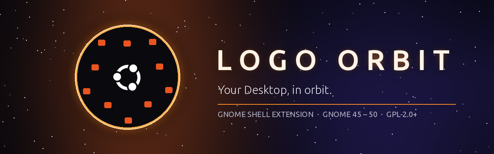
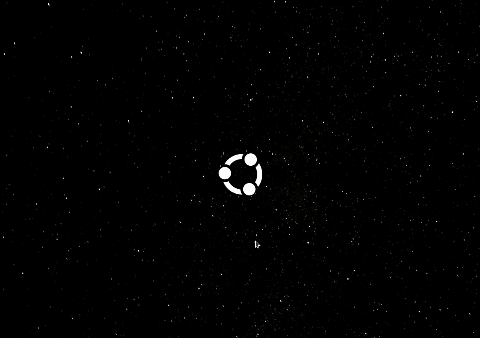
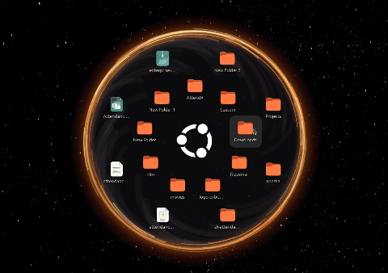
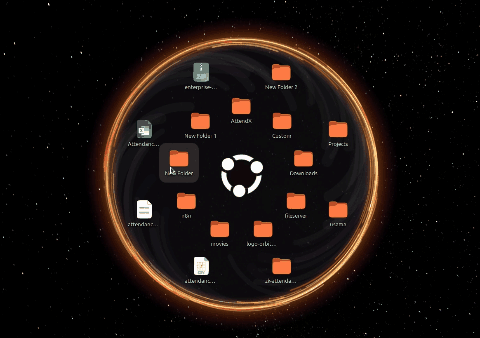
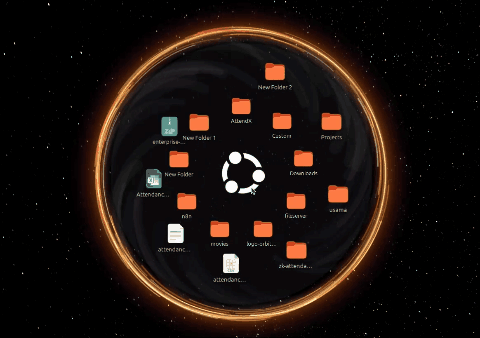

<div align="center">



<br>

**Hover the Ubuntu logo on your wallpaper and your Desktop files swirl out around it.**<br>
<sub>A GNOME Shell extension that turns desktop clutter into a glowing orbit.</sub>

<br>

[](https://extensions.gnome.org/)
[](LICENSE)
[](https://gjs.guide/)

<br>



</div>

<br>

## 🪐 Features

> Everything in `~/Desktop` lives in the orbit instead of cluttering the
> screen. Folders come first; extra items fill further rings, with no limit.

<table>
<tr>
<td width="50%" valign="top">

### 🌀 Smooth launch & landing
The logo spins while items swirl out of it ring by ring, and the dark disc
grows with them. Closing is the same in reverse.

</td>
<td width="50%" valign="top">

### 🛸 Drag & drop
Drag an item **out** onto the desktop to keep it there as a normal icon.
Drag desktop icons or files from Files **onto** the orbit to add them.
Files from other folders are moved onto the Desktop; name clashes get
" (2)", " (3)", …

</td>
</tr>
<tr>
<td valign="top">

### 🔭 Folder peek
Rest the pointer on a folder for 2 s and a side panel lists what's inside.
Click subfolders to browse into them, or files to open them.



</td>
<td valign="top">

### 🕳️ Black hole
Leave the orbit open for a minute and it collapses: every item spirals into
the logo, then the orbit closes. It's only an animation — nothing on disk
changes.



</td>
</tr>
</table>

<div align="center">

<br><sub>Dragging an item out of the orbit onto the desktop</sub>
</div>

<br>

## 🎮 Flight controls

| Action | Result |
| --- | --- |
| Hover the logo | Open the orbit |
| Move the pointer off the disc | Close the orbit |
| Click an item | Open it |
| Click the centre logo | Open `~/Desktop` in Files |
| Rest on a folder for 2 s | Peek inside it |
| Drag an item out | Put it back on the desktop |
| Drag files onto the orbit | Add them to the circle |

> [!TIP]
> On the **Snowy Ubuntu** wallpaper the extension's logo sits exactly over
> the printed logo. On any other wallpaper it appears in the centre of the
> main screen.

## 🛰️ System requirements

- **GNOME Shell 45 – 50** (Ubuntu 24.04 LTS to 26.04, Fedora 39 – 43).
  Tested on GNOME 50 (Ubuntu 26.04, Wayland).
- **Desktop Icons NG (DING)**, which Ubuntu ships by default, for the
  desktop-icon features.

## 🚀 Launch sequence — install

<details open>
<summary><b>From extensions.gnome.org</b></summary>

<br>

Once published, install it from
[extensions.gnome.org](https://extensions.gnome.org/) or the Extension
Manager app.

</details>

<details>
<summary><b>From a release ZIP</b></summary>

<br>

```sh
gnome-extensions install --force logo-orbit@usama.shell-extension.zip
```

Log out and back in (on Wayland), then enable it:

```sh
gnome-extensions enable logo-orbit@usama
```

</details>

<details>
<summary><b>From source</b></summary>

<br>

```sh
git clone https://github.com/Usama441/gnome-shell-extension-logo-orbit.git \
  ~/.local/share/gnome-shell/extensions/logo-orbit@usama
glib-compile-schemas ~/.local/share/gnome-shell/extensions/logo-orbit@usama/schemas
```

Then log out and back in and enable it as above.

</details>

## 🎛️ Mission control — settings

Open the preferences from the Extensions app, or run:

```sh
gnome-extensions prefs logo-orbit@usama
```

| Setting | Default | Range |
| --- | --- | --- |
| Black hole enabled | on | on / off |
| Seconds before the orbit collapses | 60 s | 5 s – 1 h |
| Fall animation per item | 1.8 s | 0.3 – 20 s |

Changes apply right away.

## ⚙️ Under the hood

- Items in the circle are hidden from the desktop icons by listing them in
  `~/Desktop/.hidden`. Files are never moved. Your own `.hidden` entries are
  kept, and the file is restored when the extension is disabled.
- Which items you dragged out onto the desktop is saved in
  `~/.local/share/logo-orbit/state.json`.
- The logo is drawn just above the wallpaper, so open windows cover it as
  normal.

## 🧯 Troubleshooting

<details>
<summary><b>The logo doesn't appear</b></summary>

Check that the extension is enabled and active:
`gnome-extensions info logo-orbit@usama`. On a wallpaper other than Snowy
Ubuntu, look in the centre of the main screen.
</details>

<details>
<summary><b>The orbit doesn't open</b></summary>

It only opens when nothing but the desktop is under the pointer — move
windows out of the way, and close the overview.
</details>

<details>
<summary><b>Items show on the desktop and in the circle</b></summary>

The desktop icons cache `~/Desktop/.hidden` for a few seconds; wait about
10 s.
</details>

<details>
<summary><b>Desktop icons are missing after uninstalling</b></summary>

Disable the extension before removing it so it can restore
`~/Desktop/.hidden`. If you removed it first, delete the extra names from
`~/Desktop/.hidden` by hand.
</details>

<details>
<summary><b>Errors</b></summary>

Follow the shell log while you reproduce the problem, and include the output
in a bug report:

```sh
journalctl --user -f -o cat /usr/bin/gnome-shell | grep -i 'logo orbit'
```
</details>

## 🌑 Re-entry — uninstall

```sh
gnome-extensions disable logo-orbit@usama
rm -rf ~/.local/share/gnome-shell/extensions/logo-orbit@usama \
       ~/.local/share/logo-orbit
```

Disabling first restores your `~/Desktop/.hidden`, so all desktop icons come
back.

## 🧑‍🚀 Ground control — development

The extension is plain GJS — no build step.

1. Clone the repository into
   `~/.local/share/gnome-shell/extensions/logo-orbit@usama` (or symlink it
   there).
2. Compile the settings schema: `glib-compile-schemas schemas`.
3. Test in a nested GNOME Shell so your real session isn't affected (needs
   the `mutter-devkit` helper; on Ubuntu it comes from the `mutter-dev-bin`
   package):

   ```sh
   dbus-run-session gnome-shell --devkit --wayland
   ```

   On Wayland, the running session only loads changed code after you log
   out and back in.
4. Build the upload ZIP:

   ```sh
   mkdir -p dist
   gnome-extensions pack --force --extra-source=logo.svg --extra-source=LICENSE --out-dir=dist .
   ```

   This writes `dist/logo-orbit@usama.shell-extension.zip`.

## 🌌 Wallpapers

The [`wallpapers`](wallpapers) folder has a few dark backgrounds that suit
the orbit. They are photos from [Unsplash](https://unsplash.com), used under
the [Unsplash License](https://unsplash.com/license), by Adrien Olichon,
Daniel Olah and Eastman Childs.

## ✨ Credits

Written by [Usama](https://github.com/Usama441). The Ubuntu logo is a
trademark of Canonical Ltd.

## 📜 License

Logo Orbit is free software: you can redistribute it and/or modify it under
the terms of the GNU General Public License as published by the Free Software
Foundation, either version 2 of the License, or (at your option) any later
version. See [LICENSE](LICENSE).

Changes between versions are in [CHANGELOG.md](CHANGELOG.md).

<div align="center">
<br>
<sub>🛰️ &nbsp;Made for GNOME · Your Desktop, in orbit.&nbsp; 🛰️</sub>
</div>
